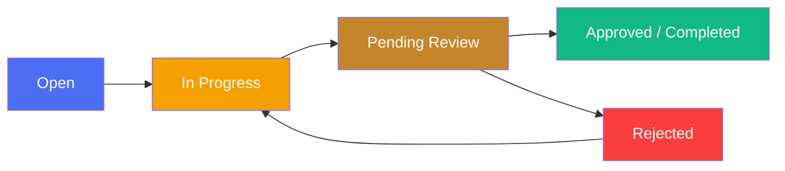

<div align="center">

<h1>🔧 &nbsp;M T &nbsp;C E N T E R</h1>

<strong>ผู้ช่วย AI ดูแลซ่อมบำรุงเครื่องจักร (CMMS) สำหรับโรงงาน GS Battery Thailand</strong>

<code>📷 Scan QR</code>&nbsp;&nbsp;→&nbsp;&nbsp;<code>🤖 AI Diagnose</code>&nbsp;&nbsp;→&nbsp;&nbsp;<code>🧾 Work Order</code>&nbsp;&nbsp;→&nbsp;&nbsp;<code>📚 Knowledge</code>&nbsp;&nbsp;→&nbsp;&nbsp;<code>📊 Dashboard</code>

<br />

[](https://nodejs.org/)
[](https://react.dev/)
[](https://www.typescriptlang.org/)
[](https://supabase.com/)
[](https://vitejs.dev/)
[](https://ai.google.dev/)

</div>


##  Table of Contents

<details open>
<summary><kbd>Click to expand</kbd></summary>

&nbsp;&nbsp;[Overview](#overview)<br />
&nbsp;&nbsp;[Tech Stack](#tech-stack)<br />
&nbsp;&nbsp;[Project Structure](#project-structure)<br />
&nbsp;&nbsp;[Features](#features)<br />
&nbsp;&nbsp;[Getting Started](#getting-started)<br />
&nbsp;&nbsp;[API Reference](#api-reference)<br />
&nbsp;&nbsp;[Deployment](#deployment)<br />
&nbsp;&nbsp;[Branch Strategy / Roadmap](#branch-strategy--roadmap)<br />

</details>


##  Overview

**MT Center — AI Machine Maintenance Assistant (CMMS)** เป็นระบบผู้ช่วยดูแลซ่อมบำรุงเครื่องจักรด้วย AI ของโรงงาน GS Battery Thailand ช่วยลด **downtime** และ **MTTR** โดยให้ช่างเทคนิคเข้าถึงข้อมูลเครื่องจักร คู่มือ อะไหล่ และคำวินิจฉัยจาก AI ได้ทันทีบนมือถือ/แท็บเล็ต วิศวกรตรวจสอบและอนุมัติใบงาน พร้อมคัดกรององค์ความรู้เข้าคลัง ส่วนหัวหน้างานเห็นภาพรวมโรงงานแบบเรียลไทม์

**เป้าหมายความสำเร็จ (ตาม PRD):**
- ลด MTTR ≥ 20% ภายใน 6 เดือน
- เพิ่ม uptime เครื่องจักร +3–5%
- อัตราการใช้งานระบบ (adoption) ≥ 80% ภายใน 3 เดือน
- ความแม่นยำของคำตอบ AI ≥ 70%
- ความคลาดเคลื่อนของสต๊อกอะไหล่ < 2%

<table align="center">
<tr>
<td align="center" width="25%">


<br /><sub>ช่างเทคนิคสแกน QR แจ้งเสีย เปิดใบงาน เบิกอะไหล่ ถาม AI</sub>

</td>
<td align="center" width="25%">


<br /><sub>วิศวกรตรวจ-อนุมัติใบงาน อัปโหลดคู่มือ ยืนยันองค์ความรู้</sub>

</td>
<td align="center" width="25%">


<br /><sub>หัวหน้างานดูแดชบอร์ด รายงาน วางกำลังคน</sub>

</td>
<td align="center" width="25%">


<br /><sub>วินิจฉัยปัญหาและตอบคำถามด้วย Gemini AI</sub>

</td>
</tr>
</table>


##  Tech Stack

<div align="center">

<strong>Backend</strong><br />
<br /><br />

<strong>Frontend</strong><br />


</div>

**Backend** (`backend/`, ESM TypeScript รันด้วย `tsx`)

| Technology | Version | Role |
|---|---|---|
|  | ^4.19.2 | HTTP server / routing |
|  | ^2.45.4 | Database client (Postgres) |
|  | ^2.4.0 | AI diagnosis / chat / embeddings |
|  | ^9.0.3 | JWT authentication |
|  | ^3.0.3 | Password hashing |
|  | ^8.6.2 | Login rate limiting |
|  | ~5.8 | Type safety |
|  | ^0.18.5 | Excel import scripts |

**Frontend** (`frontend/`, package name ยังคงเป็น `react-example`)

| Technology | Version | Role |
|---|---|---|
|  | 19.0.1 | UI library |
|  | ^6.2.3 | Build tool / dev server |
|  | ^4.1.14 | Styling |
|  | ^9.7.0 | Live Floor 4D (3D scene) |
|  | ^10.7.8 | 3D helpers |
|  | ^0.180.0 | 3D engine |
|  | ^3.10.1 | Dashboard charts |
|  | ^12.23.24 | Animations |
|  | ^11.26.25 | Dialogs / alerts |
|  | ^10.1.0 | Render AI markdown replies |
|  | ^1.4.0 | QR code scanning |
|  | ^4.21.2 | Dev static server (`server.ts`) |


##  Project Structure

```
mtcenter/
├── 📂 backend/
│   └── 📂 src/
│       ├── 📄 config.ts              # ตรวจสอบ env ตอน boot
│       ├── 📄 index.ts               # Express app, middleware, static SPA
│       ├── 📂 lib/                   # aiActionTokens, aiContext, aiInteractionLog, auth,
│       │                             # embeddings, knowledgeDraft, knowledgeStats,
│       │                             # manualChunker, manualIndexer, manualRetrieval (RAG),
│       │                             # mappers, mockAssistant (AI_MODE=mock),
│       │                             # queryHelpers, reviewQueue, supabase, thresholds
│       ├── 📂 middleware/            # authenticate, errorHandler, loginRateLimit,
│       │                             # requireAuth, requireRole, requireSupervisor
│       └── 📂 routes/                # ai, auth, knowledge, machines, manuals,
│                                     # partWithdrawals, pmPlans, spareParts, users, workOrders
│
├── 📂 frontend/
│   └── 📂 src/
│       ├── 📄 App.tsx                # root, role-based tabs
│       ├── 📄 main.tsx
│       ├── 📄 types.ts
│       ├── 📄 index.css
│       ├── 📂 components/            # LoginPage, ChangePasswordScreen, Sidebar, TopBar,
│       │                             # SettingsModal, HelpModal, AIAssistantDrawer,
│       │                             # AIAssistantToggleButton, CreateWorkOrderModal,
│       │                             # EditWorkOrderModal, WorkOrderDetailModal,
│       │                             # WorkOrderForm, MachineSelect, MicDictationButton,
│       │                             # GloveFriendlyCTA, PixelAILogo
│       │   ├── 📂 ai/                # AiChatHistoryPanel, AssistantConversation
│       │   ├── 📂 ui/                # Modal, Pagination
│       │   └── 📂 views/             # AIChatView, AllWorkOrdersView, CreateWorkOrderView,
│       │       │                     # KnowledgeBaseView, KnowledgeOverviewPanel,
│       │       │                     # KnowledgeReviewView, MachineAdminView, ManualsView,
│       │       │                     # MyWorkOrdersView, PendingReviewView, ScanMachineView,
│       │       │                     # SparePartsAdminView, SparePartsView,
│       │       │                     # SupervisorDashboardView, SupervisorReportsView,
│       │       │                     # TelemetryTrendCard, UploadManualView
│       │       └── 📂 liveFloor/     # InspectorPanel, InspectorRobot, LiveFloor4DScene,
│       │                             # LiveFloorFacility, LiveFloorHUD, LiveFloorView,
│       │                             # liveFloorTheme, machineParts
│       ├── 📂 contexts/              # AuthContext
│       ├── 📂 hooks/                 # useAiChatSessions, useDebouncedValue,
│       │                             # useQrScanner, useSpeechToText
│       ├── 📂 services/              # apiService.ts (VITE_API_URL + x-user-id header)
│       ├── 📂 lib/                   # aiActions, floorLayout, floorNavGraph,
│       │                             # floorSimulation, format, inspectionAgent,
│       │                             # manualCategories, manualToc, pillStyles,
│       │                             # qrPayload, swal, thresholds, workOrderStatus
│       ├── 📂 data/                  # mockData.ts (MOCK_KB_ARTICLES เท่านั้น)
│       └── 📂 docs/                  # PRD.md, 2.3_Design_System_Template.md,
│                                     # Cost_Benefit_Analysis.md, data-import-spec.md,
│                                     # Manual_MD/
│
├── 📄 Dockerfile
├── 📄 railway.json
└── 📄 package.json                   # scripts monorepo (dev, build, start)
```


##  Features

### 

- เข้าสู่ระบบด้วย JWT และเก็บรหัสผ่านด้วย bcrypt
- บังคับให้เปลี่ยนรหัสผ่านในการเข้าใช้ครั้งแรก (403 `PASSWORD_CHANGE_REQUIRED`)
- จำกัดจำนวนครั้งการ login ต่อ IP (rate limit) เพื่อป้องกัน brute-force
- แบ่งสิทธิ์การใช้งานตามบทบาท: technician / engineer / supervisor

### 

- สแกน QR code ด้วย jsQR เพื่อดูข้อมูลเครื่องจักรทันที
- ดูค่าการอ่านเซนเซอร์ (readings) และกราฟแนวโน้ม telemetry

### 

- สร้าง แก้ไข และมอบหมายใบงานซ่อมบำรุง
- แนบไฟล์ประกอบใบงาน
- วิศวกร/หัวหน้างานตรวจสอบและอนุมัติใบงาน



<table align="center">
<tr><th>Role</th><th>สิทธิ์ในใบงาน</th></tr>
<tr><td align="center">technician</td><td>สร้าง / แก้ไขใบงานของตนเอง</td></tr>
<tr><td align="center">engineer</td><td>ตรวจสอบ / อนุมัติ / จัดการไฟล์แนบ</td></tr>
<tr><td align="center">supervisor</td><td>อนุมัติ / ดูภาพรวมทั้งหมด</td></tr>
</table>

### 

- ขับเคลื่อนด้วย Gemini AI รองรับสองโหมด: `mock` (rule/DB based ไม่เรียก LLM) และ `live`
- แชทถาม-ตอบ วินิจฉัยปัญหาเครื่องจักร (diagnose) และให้ feedback ผลลัพธ์
- ค้นคืนข้อมูลจากคู่มือด้วยเทคนิค RAG ผ่าน embeddings
- พิมพ์หรือพูดด้วย speech-to-text

### 

- จัดการสต๊อกอะไหล่ เบิกอะไหล่ พร้อมสถิติการเบิกใช้
- ดูแผนการบำรุงรักษาเชิงป้องกัน (PM Plans)

### 

- ร่างองค์ความรู้อัตโนมัติจากใบงานที่ปิดแล้ว
- วิศวกรตรวจสอบและยืนยันเข้าคลังความรู้
- ดูภาพรวมและสถิติการนำองค์ความรู้ไปใช้

### 

- ผังโรงงานแบบ 3D ด้วย react-three-fiber
- หุ่นยนต์ AI เดินตรวจเครื่องจักรในผังโรงงาน

### 

- แดชบอร์ดและรายงานภาพรวมโรงงานด้วย recharts


##  Getting Started

<table align="center">
<tr><th>Requirement</th><th>Version</th></tr>
<tr><td align="center"></td><td align="center">&gt;= 20</td></tr>
<tr><td align="center"></td><td align="center">latest</td></tr>
<tr><td align="center"></td><td align="center">โปรเจกต์ Supabase (Postgres)</td></tr>
</table>

**Install**

```bash
npm run install:all
```

**Dev (backend + frontend พร้อมกัน)**

```bash
npm run dev
```

**Build**

```bash
npm run build
```

<details>
<summary></summary>

```env
PORT=4000
SUPABASE_URL=                     # required
SUPABASE_SERVICE_ROLE_KEY=        # required
# JWT_SECRET: สร้าง secret สุ่ม >= 32 ตัวอักษร
# PowerShell: -join ((48..57)+(65..90)+(97..122) | Get-Random -Count 32 | % {[char]$_})
# openssl:    openssl rand -hex 32
JWT_SECRET=                       # required, >= 32 ตัวอักษร
GEMINI_API_KEY=                   # optional
CORS_ORIGIN=http://localhost:3000 # comma separated
AI_MODE=mock                      # mock | live
GEMINI_EMBED_RPM=
STATIC_DIR=./public
```

</details>

<details>
<summary></summary>

```env
VITE_API_URL=   # default "" = same origin
```

</details>

> **Testing:** ยังไม่มี test framework ในโปรเจกนี้ (ไม่มี vitest/jest/playwright) — เป็นงานที่วางแผนไว้


##  API Reference

> Base URL: `/api`

<details>
<summary><strong>Auth</strong> — <code>/api/auth</code> (public)</summary>

| Method | Endpoint | Description |
|---|---|---|
|  | `/api/auth/login` | เข้าสู่ระบบ (rate limit ต่อ IP) |
|  | `/api/auth/me` | ข้อมูลผู้ใช้ปัจจุบัน |
|  | `/api/auth/change-password` | เปลี่ยนรหัสผ่าน |

</details>

<details>
<summary><strong>Users</strong> — <code>/api/users</code></summary>

| Method | Endpoint | Description |
|---|---|---|
|  | `/api/users` | รายชื่อผู้ใช้ |

</details>

<details>
<summary><strong>Machines</strong> — <code>/api/machines</code></summary>

| Method | Endpoint | Description |
|---|---|---|
|  | `/api/machines/stats` | สถิติเครื่องจักร |
|  | `/api/machines` | รายการเครื่องจักร |
|  | `/api/machines` | สร้างเครื่องจักร (admin) |
|  | `/api/machines/:id` | รายละเอียดเครื่องจักร |
|  | `/api/machines/:id/readings` | ค่าการอ่านเซนเซอร์ |
|  | `/api/machines/:id` | แก้ไขเครื่องจักร (admin) |
|  | `/api/machines/:id` | ลบเครื่องจักร (admin) |

</details>

<details>
<summary><strong>Work Orders</strong> — <code>/api/work-orders</code></summary>

| Method | Endpoint | Description |
|---|---|---|
|  | `/api/work-orders/stats` | สถิติใบงาน |
|  | `/api/work-orders` | รายการใบงาน |
|  | `/api/work-orders` | สร้างใบงาน |
|  | `/api/work-orders/:id` | แก้ไขใบงาน |
|  | `/api/work-orders/:id` | ลบใบงาน |
|  | `/api/work-orders/:id/approve` | อนุมัติใบงาน (engineer/supervisor) |
|  | `/api/work-orders/:id/attachments` | รายการไฟล์แนบ |
|  | `/api/work-orders/:id/attachments/upload-url` | ขอ URL อัปโหลด (eng/sup) |
|  | `/api/work-orders/:id/attachments` | บันทึกไฟล์แนบ (eng/sup) |
|  | `/api/work-orders/:id/attachments/:attachmentId/file` | ดาวน์โหลดไฟล์แนบ |
|  | `/api/work-orders/:id/attachments/:attachmentId` | ลบไฟล์แนบ (eng/sup) |

</details>

<details>
<summary><strong>Spare Parts</strong> — <code>/api/spare-parts</code></summary>

| Method | Endpoint | Description |
|---|---|---|
|  | `/api/spare-parts/stats` | สถิติอะไหล่ |
|  | `/api/spare-parts/for-machine` | อะไหล่ตามเครื่องจักร |
|  | `/api/spare-parts` | รายการอะไหล่ |
|  | `/api/spare-parts` | สร้างอะไหล่ (supervisor) |
|  | `/api/spare-parts/:id/stock` | ปรับสต๊อก (supervisor) |
|  | `/api/spare-parts/:id` | แก้ไขอะไหล่ (supervisor) |
|  | `/api/spare-parts/:id` | ลบอะไหล่ (supervisor) |

</details>

<details>
<summary><strong>Part Withdrawals</strong> — <code>/api/part-withdrawals</code></summary>

| Method | Endpoint | Description |
|---|---|---|
|  | `/api/part-withdrawals/stats` | สถิติการเบิก |
|  | `/api/part-withdrawals` | รายการการเบิก |
|  | `/api/part-withdrawals` | เบิกอะไหล่ |

</details>

<details>
<summary><strong>Manuals</strong> — <code>/api/manuals</code></summary>

| Method | Endpoint | Description |
|---|---|---|
|  | `/api/manuals` | รายการคู่มือ |
|  | `/api/manuals/upload-url` | ขอ URL อัปโหลดคู่มือ (manual admin) |
|  | `/api/manuals` | บันทึกคู่มือ (manual admin) |
|  | `/api/manuals/:id` | ลบคู่มือ |
|  | `/api/manuals/:id` | แก้ไขคู่มือ |
|  | `/api/manuals/:id/file` | ดาวน์โหลดไฟล์คู่มือ |
|  | `/api/manuals/:id/content` | เนื้อหาคู่มือ |
|  | `/api/manuals/:id/index` | สร้าง index/embeddings คู่มือ |

</details>

<details>
<summary><strong>PM Plans</strong> — <code>/api/pm-plans</code></summary>

| Method | Endpoint | Description |
|---|---|---|
|  | `/api/pm-plans/stats` | สถิติแผน PM |
|  | `/api/pm-plans` | รายการแผน PM |
|  | `/api/pm-plans/:id` | รายละเอียดแผน PM |

</details>

<details>
<summary><strong>Knowledge</strong> — <code>/api/knowledge</code></summary>

| Method | Endpoint | Description |
|---|---|---|
|  | `/api/knowledge/review-queue` | คิวใบงานรอรีวิว (จัดลำดับด้วย rule) |
|  | `/api/knowledge/draft/:workOrderId` | ร่างองค์ความรู้ (ไม่บันทึก) |
|  | `/api/knowledge/confirm` | วิศวกรยืนยันเข้าคลัง |
|  | `/api/knowledge/overview` | ภาพรวม + สถิติการนำไปใช้ |
|  | `/api/knowledge` | รายการที่ยืนยันแล้ว |
|  | `/api/knowledge/:id/content` | เนื้อหาองค์ความรู้ |

</details>

<details>
<summary><strong>AI</strong> — <code>/api/ai</code></summary>

| Method | Endpoint | Description |
|---|---|---|
|  | `/api/ai/chat` | แชทกับผู้ช่วย AI |
|  | `/api/ai/feedback` | ส่ง feedback คำตอบ AI |
|  | `/api/ai/mode` | ดูโหมด AI ปัจจุบัน (mock/live) |
|  | `/api/ai/diagnose` | วินิจฉัยปัญหาเครื่องจักร |

</details>


##  Deployment

ระบบ deploy เป็น **single container** ที่เสิร์ฟทั้ง API และ static frontend ด้วย `Dockerfile` แบบ 3-stage:

1. **frontend-build** (`node:22-slim`) — `npm ci`, ตั้ง `VITE_API_URL=""`, `vite build`
2. **backend-build** (`node:22-slim`) — `npm ci`, `tsc`
3. **runner** (`node:22-slim`, `NODE_ENV=production`) — `npm ci --omit=dev`, copy backend `dist` + frontend `dist` เป็น `./public`, `EXPOSE 4000`, `CMD node dist/index.js`

`railway.json` กำหนด builder เป็น `DOCKERFILE`, `healthcheckPath` = `/api/health`, timeout 100 วินาที, restart policy `ON_FAILURE` สูงสุด 10 ครั้ง


##  Branch Strategy / Roadmap

| Branch | Purpose |
|---|---|
| `main` | Production |
| `develop` | Active Development |
| `feature/*` | Feature Branches |


<div align="center">

---

<sub>Built with ❤ by <strong>Pantira S.</strong> &mdash; Siam GS Battery · Private, internal use only</sub>

</div>
</content>
