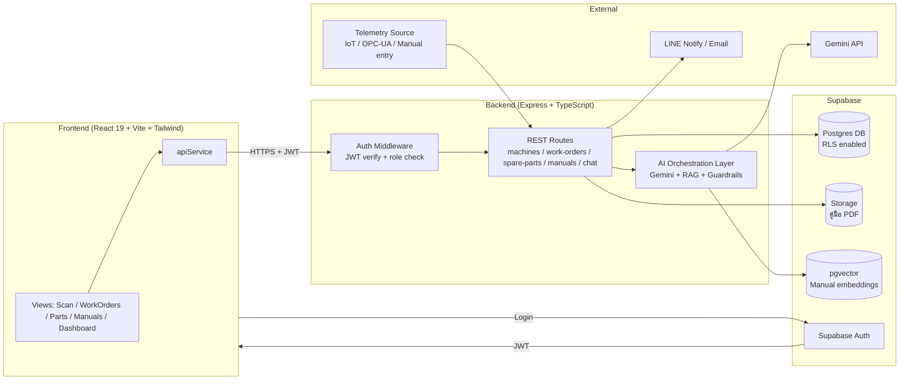

# PRD: MT Center — AI Machine Maintenance Assistant (CMMS)

**เอกสาร:** Product Requirements Document
**เวอร์ชัน:** 1.0
**วันที่:** 2026-08-11
**สถานะ:** Draft — สำหรับตัดสินใจแผนงาน Production Readiness

**คำถามหลักของเจ้าของผลิตภัณฑ์:**
> "จะต้องเพิ่มอะไรบ้างเพื่อให้ระบบแบบนี้ (ที่มี AI model) ใช้งานได้จริงใน production"

เอกสารนี้ตอบคำถามนั้นโดยตรงในหมวดที่ 4 ส่วนหมวดอื่นให้บริบทประกอบ

---

## 1. ภาพรวมผลิตภัณฑ์และเป้าหมาย

### 1.1 วิสัยทัศน์ (Vision)

MT Center คือระบบผู้ช่วยซ่อมบำรุงเครื่องจักรอัจฉริยะ (AI-powered CMMS) สำหรับโรงงาน GS Battery Thailand
เป้าหมายคือลดเวลาหยุดเครื่อง (downtime) และเวลาซ่อมเฉลี่ย (MTTR) โดยให้ช่างเทคนิคหน้างานเข้าถึงข้อมูลเครื่องจักร คู่มือ อะไหล่ และคำแนะนำวินิจฉัยปัญหาจาก AI ได้ทันทีผ่านมือถือ/แท็บเล็ต พร้อมให้วิศวกรและหัวหน้างานควบคุมคุณภาพงานและมองภาพรวมโรงงานแบบเรียลไทม์

### 1.2 กลุ่มผู้ใช้งาน (Personas)

| Role | ชื่อไทย | หน้าที่หลัก | เป้าหมายในระบบ |
|---|---|---|---|
| `technician` | ช่างเทคนิค | สแกนเครื่อง แจ้งซ่อม ทำงานตามใบงาน เบิกอะไหล่ ถาม AI วินิจฉัย | ปิดงานเร็ว ถูกต้อง ปลอดภัย |
| `engineer` | วิศวกร | รีวิว/อนุมัติใบงาน อัปโหลดคู่มือ ดูแลคลังความรู้ | ควบคุมคุณภาพงานซ่อม สะสมองค์ความรู้ |
| `supervisor` | หัวหน้างาน | มอง Dashboard ภาพรวมโรงงาน ดูรายงาน วางแผนกำลังคน | ตัดสินใจเชิงบริหาร ลด downtime รวม |

### 1.3 ตัวชี้วัดความสำเร็จ (Success Metrics)

| ตัวชี้วัด | นิยาม | เป้าหมายเบื้องต้น |
|---|---|---|
| MTTR (Mean Time To Repair) | เวลาเฉลี่ยจากเปิดใบงานถึงปิดงาน | ลดลง ≥ 20% ใน 6 เดือนแรก |
| Machine Uptime | % เวลาที่เครื่องพร้อมใช้งาน | เพิ่มขึ้น ≥ 3-5% |
| Adoption Rate | % ช่างที่ใช้ระบบแทนกระดาษ/Excel ต่อสัปดาห์ | ≥ 80% ภายใน 3 เดือน |
| AI Diagnosis Accuracy | % คำแนะนำ AI ที่ช่างยืนยันว่าตรงประเด็น | ≥ 70% พร้อมมีระบบเก็บ feedback |
| Stock Accuracy | ความคลาดเคลื่อนสต๊อกอะไหล่จริง vs ระบบ | < 2% |
| Incident จาก AI ผิดพลาด | จำนวนครั้งที่ AI แนะนำผิดจนเกิดผลเสีย | 0 (ต้องมี human-in-the-loop คุมไว้) |

---

## 2. สถานะปัจจุบัน (Current State)

โค้ดฐาน frontend (`frontend/src/App.tsx`, `frontend/src/types.ts`, `frontend/src/data/mockData.ts`, `frontend/src/components/views/*`) เป็น **prototype ที่ยังไม่พร้อม production** เพราะ:

- **ข้อมูลทั้งหมดเป็น mock**: `MOCK_USERS`, `MOCK_MACHINES`, `MOCK_WORK_ORDERS`, `MOCK_SPARE_PARTS`, `MOCK_MANUALS` ถูก import เข้า React state ตรงๆ ใน `App.tsx` ไม่มีการเรียก API
- **ไม่มีระบบ Authentication**: การสลับ role (`technician`/`engineer`/`supervisor`) ทำผ่าน `handleRoleChange` ใน UI ล้วนๆ ใครก็สลับเป็นวิศวกรหรือหัวหน้างานได้โดยไม่ต้อง login — ไม่มีการพิสูจน์ตัวตนหรือแบ่งสิทธิ์จริง
- **ข้อมูลหายเมื่อ refresh**: ใบงานที่สร้างใหม่ (`handleCreateWorkOrderSubmit`, `handleAutoCreateWorkOrder`) เก็บใน React state (`useState`) เท่านั้น ไม่ persist ลง DB — reload หน้าเว็บแล้วหายทั้งหมด
- **Reports/Telemetry เป็น hardcoded**: `SupervisorReportsView` และข้อมูลสุขภาพเครื่อง (`healthScore`, `spindleTemp`, `vibrationMms`) ใน `mockData.ts` เป็นตัวเลขคงที่ ไม่ได้มาจากเซนเซอร์หรือฐานข้อมูลจริง
- **Upload manual เป็น simulation**: `UploadManualView` ไม่ได้อัปโหลดไฟล์ขึ้น storage จริง เป็นเพียง UI flow จำลอง ไม่มีไฟล์ PDF จริงถูกเก็บหรือ index
- **ไม่มี audit trail**: ไม่มีการบันทึกว่าใครแก้ไขอะไร เมื่อไหร่ ย้อนกลับไม่ได้
- **AI action ยังไม่มีการควบคุม**: ฟีเจอร์ `[ACTION:CREATE_WORK_ORDER]` ที่ AI (Gemini) สร้างใบงานอัตโนมัติ ปัจจุบันสร้างและ commit เข้าระบบทันทีโดยไม่มีขั้นตอนให้คนยืนยันก่อน

**กำลังดำเนินการ (in progress โดยทีม):** การย้ายไปใช้ Supabase Postgres + Express/TypeScript backend (`backend/src/routes/machines.ts`, `spareParts.ts`, `users.ts`, `backend/supabase/migrations/0001_init.sql`) และเชื่อม frontend ผ่าน apiService — เป็นจุดเริ่มต้นของ Phase 1 ตามที่ระบุในหมวด 7

---

## 3. สถาปัตยกรรมเป้าหมาย (Target Architecture)

แนวทาง: Frontend ไม่คุย Supabase ตรง ไม่ฝัง service key ฝั่ง client — ทุกอย่างผ่าน backend กลางเพื่อคุม business logic, สิทธิ์การเข้าถึง และ AI orchestration

หลักการสำคัญ:
- Frontend เก็บเฉพาะ JWT ที่ได้จาก Supabase Auth ส่งแนบทุก request ไป backend
- Backend เป็นจุดเดียวที่ verify token, ตรวจ role, เขียน DB, และเรียก Gemini — ไม่ให้ frontend เรียก Gemini ตรง (ป้องกัน API key รั่วและควบคุม cost/safety ได้)
- Supabase RLS เป็นเกราะชั้นที่สอง กันกรณี backend มีช่องโหว่หรือมีการเรียก DB ตรงในอนาคต (เช่น Edge Function)

---

## 4. สิ่งที่ต้องเพิ่มเพื่อใช้งานจริงใน Production

หมวดนี้คือคำตอบหลักของคำถาม PO ระดับ priority: **P0 = ต้องมีก่อนขึ้น production, P1 = ควรมีในระยะสั้นหลังขึ้นระบบ, P2 = พัฒนาต่อเนื่อง/nice-to-have**

### 4.1 Authentication & Authorization

| งาน | รายละเอียด | Priority |
|---|---|---|
| Supabase Auth (login จริง) | แทนที่การ "เลือก role" ใน UI ด้วย login ด้วย email/password หรือ SSO ของโรงงาน | P0 |
| ออก JWT และแนบทุก request | frontend เก็บ session, apiService แนบ `Authorization: Bearer` | P0 |
| Role-based access ฝั่ง backend | Middleware ตรวจ role จาก JWT/DB ทุก endpoint ที่ต้องจำกัดสิทธิ์ (เช่น อนุมัติใบงาน = engineer/supervisor เท่านั้น) — ปัจจุบันสลับ role ได้อิสระจาก UI โดยไม่มีการตรวจสอบจริง | P0 |
| Row Level Security (RLS) ใน Postgres | ป้องกันชั้นสอง กรณี query ตรงหรือ backend มีบั๊ก เช่น ช่างเห็นได้เฉพาะใบงานที่เกี่ยวข้อง | P0 |
| Session management / refresh token | จัดการ token หมดอายุ, logout, forced re-login | P1 |
| Password policy / MFA (ถ้าจำเป็น) | ตามนโยบายความปลอดภัยโรงงาน | P2 |

### 4.2 Data Integrity

| งาน | รายละเอียด | Priority |
|---|---|---|
| Stock decrement อัตโนมัติ | เมื่อใบงานเบิกอะไหล่และอนุมัติ ต้องตัดสต๊อกจริงใน `spare_parts` แบบ transaction (ป้องกัน race condition เบิกซ้ำซ้อน) | P0 |
| Status workflow บังคับฝั่ง server | เช่น ห้าม `pending` → `completed` ข้าม `in_progress`/`review` ตรงๆ ต้องมี state machine ที่ backend validate ไม่ใช่ปล่อยให้ frontend ส่ง status อะไรก็ได้ | P0 |
| Audit log | บันทึกทุกการเปลี่ยนแปลงสำคัญ (ใครแก้ status, ใครอนุมัติ, ใครแก้ไขอะไหล่) พร้อม timestamp เพื่อ trace ย้อนหลังและรองรับการตรวจสอบ | P0 |
| Soft delete | ห้าม hard delete ข้อมูล machines/work_orders/spare_parts — ใช้ `deleted_at` แทน เพื่อรักษาความสมบูรณ์ของ audit/report ย้อนหลัง | P1 |
| Optimistic locking / concurrency control | ป้องกันสองคนแก้ใบงานเดียวกันพร้อมกันแล้วข้อมูลทับกัน | P1 |
| Data validation ฝั่ง backend | Schema validation (เช่น zod) ทุก endpoint ไม่พึ่ง validation ฝั่ง frontend อย่างเดียว | P0 |

### 4.3 File Storage (คู่มือเครื่องจักร)

| งาน | รายละเอียด | Priority |
|---|---|---|
| อัปโหลดไฟล์ PDF จริง | เชื่อม `UploadManualView` เข้ากับ Supabase Storage แทน simulation ปัจจุบัน | P0 |
| Virus/type scanning | ตรวจชนิดไฟล์และขนาดก่อนรับเข้า storage | P1 |
| แปลง/สกัดข้อความจาก PDF | PDF → text/markdown เพื่อใช้ index (รองรับภาษาไทย/อังกฤษปน) | P1 |
| Index สำหรับ AI (embedding) | แปลงเนื้อหาคู่มือเป็น vector เก็บใน pgvector เพื่อใช้ RAG (ดู 4.5) | P1 |
| Access control ไฟล์ | จำกัดสิทธิ์ดาวน์โหลดตาม role/สังกัดเครื่องจักร | P1 |

### 4.4 Telemetry จริงจากเครื่องจักร

| งาน | รายละเอียด | Priority |
|---|---|---|
| Ingestion pipeline | รับค่าจากเครื่องจักรจริง (IoT sensor / OPC-UA gateway) หรือ manual entry โดยช่าง แทนตัวเลข `healthScore`, `spindleTemp`, `vibrationMms` ที่ hardcode ใน mock data | P1 |
| ตาราง telemetry/time-series | เก็บ log ค่าตามเวลา ไม่ใช่แค่ค่าล่าสุด เพื่อทำ trend/report | P1 |
| แทนที่ SupervisorDashboard/Reports แบบ hardcode | ให้ดึงจากข้อมูลจริงใน DB แทน `HISTORICAL_DATA` และค่าคงที่ปัจจุบัน | P1 |
| Threshold/Alert rule | กำหนดค่าผิดปกติที่ trigger แจ้งเตือนหรือ auto-create work order | P2 |

### 4.5 AI ให้พร้อมใช้งานจริง (Production-Ready AI)

| งาน | รายละเอียด | Priority |
|---|---|---|
| RAG over manuals (pgvector) | ให้ AI ตอบโดยอ้างอิงคู่มือเครื่องจักรจริงแทนความรู้ทั่วไปของโมเดล ลด hallucination | P0 |
| Human-in-the-loop สำหรับ auto-create work order | เมื่อ AI ตรวจพบ `[ACTION:CREATE_WORK_ORDER]` ต้องสร้างเป็น **draft** ให้ช่าง/วิศวกรกดยืนยันก่อนเข้าสู่ระบบจริง ห้าม commit อัตโนมัติทันทีเหมือนปัจจุบัน | P0 |
| Prompt safety / guardrail | ป้องกัน prompt injection จากข้อความช่าง, จำกัดขอบเขตคำตอบ AI ไม่ให้แนะนำสิ่งที่เป็นอันตราย (เช่น ข้ามขั้นตอน Lockout-Tagout) | P0 |
| Rate limiting | จำกัดจำนวนคำขอ AI ต่อผู้ใช้/ต่อนาที ป้องกัน abuse และคุม cost | P0 |
| Cost control / token budget | ติดตามการใช้ Gemini API, ตั้ง budget alert, cache คำตอบที่ซ้ำ | P1 |
| Fallback เมื่อ AI ล่ม/timeout | ระบบต้องใช้งานต่อได้ (สร้าง/ปิดใบงานได้ปกติ) แม้ Gemini ไม่ตอบสนอง — แสดงข้อความแจ้งผู้ใช้อย่างชัดเจน | P0 |
| เก็บ feedback/accuracy ของ AI diagnosis | ให้ช่างกด "ตรง/ไม่ตรงประเด็น" หลังใช้คำแนะนำ AI เพื่อวัด accuracy และนำไป fine-tune prompt | P1 |
| PDPA / ข้อมูลส่วนบุคคล | ไม่ส่งข้อมูลส่วนบุคคล (ชื่อ-สกุลช่าง, employee ID) เข้า prompt โดยไม่จำเป็น, มี data retention policy สำหรับ chat log, แจ้ง consent การใช้ AI ประมวลผลข้อมูล | P0 |
| Logging การสนทนากับ AI | เก็บ log เพื่อ audit และ debug แต่ต้องเข้ากันได้กับ PDPA ข้างต้น | P1 |

### 4.6 Notifications

| งาน | รายละเอียด | Priority |
|---|---|---|
| แจ้งเตือนงานใหม่ | เมื่อมีใบงานใหม่ถูก assign ถึงช่าง แจ้งผ่าน LINE Notify/LINE OA, email หรือ in-app notification | P1 |
| แจ้งเตือนใกล้ deadline | เตือนก่อนถึง `dueDate` ของใบงาน | P1 |
| แจ้งเตือนอะไหล่ใกล้หมด | แจ้งเมื่อ `stockQuantity` ต่ำกว่า `minThreshold` | P1 |
| In-app notification center | ศูนย์รวมแจ้งเตือนในแอปสำหรับผู้ที่ไม่ได้เชื่อม LINE/email | P2 |

### 4.7 Reports จริงจากฐานข้อมูล

| งาน | รายละเอียด | Priority |
|---|---|---|
| แทนที่ HISTORICAL_DATA hardcode | `SupervisorReportsView` ต้อง query จริงจาก `work_orders`/telemetry แทนข้อมูลตัวอย่างคงที่ | P1 |
| Export รายงาน | Export เป็น PDF/Excel สำหรับใช้รายงานผู้บริหาร | P2 |
| Dashboard แบบ real-time/near-real-time | อัปเดต Dashboard หัวหน้างานโดยไม่ต้อง refresh (polling หรือ realtime subscription ของ Supabase) | P2 |

### 4.8 Non-Functional Requirements

| หัวข้อ | รายละเอียด | Priority |
|---|---|---|
| Performance | Pagination/lazy loading สำหรับรายการใบงาน/อะไหล่จำนวนมาก, index ฐานข้อมูลที่เหมาะสม | P0 |
| Offline / PWA สำหรับหน้างาน | หน้าโรงงานสัญญาณ WiFi อาจไม่เสถียร ควรรองรับ cache ข้อมูลพื้นฐาน (เครื่อง, คู่มือ) และ queue การส่งข้อมูลเมื่อกลับมาออนไลน์ | P2 |
| Testing | Unit test (backend logic, stock decrement, status workflow), integration test (API), E2E test (flow หลักของแต่ละ role) | P0 |
| CI/CD | Pipeline build/test/deploy อัตโนมัติ แยก environment dev/staging/production | P0 |
| Monitoring & Logging | Application logs, error tracking (เช่น Sentry), uptime monitoring, alert เมื่อ backend/AI ล่ม | P0 |
| Backup & Disaster Recovery | Backup Supabase Postgres อัตโนมัติ, แผนกู้คืนข้อมูล, ทดสอบ restore เป็นระยะ | P0 |
| Security review | ตรวจสอบช่องโหว่ (OWASP), penetration test ก่อนขึ้น production จริง, secret management (ไม่ hardcode API key) | P0 |
| Accessibility / รองรับอุปกรณ์หน้างาน | ทดสอบบนมือถือ/แท็บเล็ตที่ช่างใช้จริงหน้าเครื่องจักร (แสงจ้า, มือเปื้อนน้ำมัน ฯลฯ) | P1 |

---

## 5. Data Model สรุป

ตารางหลักที่ต้องมีใน Supabase Postgres (อิงจาก `frontend/src/types.ts` และงานที่กำลังสร้างใน `backend/supabase/migrations/0001_init.sql`):

| ตาราง | คำอธิบาย | ฟิลด์สำคัญ |
|---|---|---|
| `profiles` | ผู้ใช้งานระบบ เชื่อมกับ Supabase Auth (`auth.users`) | id, name, role (`technician`/`engineer`/`supervisor`), employee_id, department |
| `machines` | เครื่องจักรในโรงงาน | id, code, name, model, location, status, health_score, spindle_temp, vibration_mms, operating_hours, last/next_maintenance |
| `work_orders` | ใบงานซ่อมบำรุง | id, code, machine_id (FK), title, priority, status, technician_id, engineer_reviewer_id, assigned_date, due_date, description, ai_verification_score, created_by, timestamps |
| `work_order_parts` | ความสัมพันธ์ many-to-many ระหว่างใบงานกับอะไหล่ที่เบิก | work_order_id (FK), spare_part_id (FK), quantity, status (pending/issued) |
| `spare_parts` | คลังอะไหล่ | id, code, name, category, stock_quantity, min_threshold, location_rack, unit_price, status |
| `manuals` | คู่มือเครื่องจักร | id, title, machine_model, category, storage_path (Supabase Storage), pages_count, ai_indexed, uploaded_by, tags |
| `manual_embeddings` (เพิ่มใน Phase 3) | chunk เนื้อหาคู่มือ + vector สำหรับ RAG | id, manual_id (FK), content_chunk, embedding (pgvector), page_ref |
| `chat_messages` (เพิ่มใน Phase 2/3) | ประวัติสนทนากับ AI | id, user_id, machine_id, sender, text, is_ai_diagnostic, created_at |
| `audit_logs` (เพิ่มใน Phase 2) | บันทึกการเปลี่ยนแปลงข้อมูลสำคัญ | id, table_name, record_id, action, changed_by, old_value, new_value, created_at |
| `telemetry_readings` (เพิ่มใน Phase 3) | ค่าที่วัดได้ตามเวลา | id, machine_id (FK), metric, value, source (iot/manual), recorded_at |

ความสัมพันธ์หลัก: `machines` 1-N `work_orders`, `work_orders` N-N `spare_parts` ผ่าน `work_order_parts`, `machines` 1-N `manuals` (ตาม model), `profiles` 1-N `work_orders` (ผู้รับผิดชอบ/ผู้อนุมัติ)

---

## 6. API สรุป (REST Endpoints หลัก)

| Method | Endpoint | คำอธิบาย | สิทธิ์ |
|---|---|---|---|
| POST | `/api/auth/login` | เข้าสู่ระบบ (ผ่าน Supabase Auth) | Public |
| GET | `/api/profiles/me` | ข้อมูลผู้ใช้ปัจจุบันจาก token | ทุก role |
| GET | `/api/machines` | รายการเครื่องจักรทั้งหมด | ทุก role |
| GET | `/api/machines/:id` | รายละเอียดเครื่องจักร + telemetry ล่าสุด | ทุก role |
| GET | `/api/work-orders` | รายการใบงาน (filter ตาม role/สถานะ) | ทุก role |
| POST | `/api/work-orders` | สร้างใบงานใหม่ | technician, engineer, supervisor |
| PATCH | `/api/work-orders/:id/status` | เปลี่ยนสถานะใบงาน (ผ่าน state machine ฝั่ง server) | ตาม workflow |
| POST | `/api/work-orders/:id/approve` | อนุมัติใบงาน | engineer, supervisor |
| POST | `/api/work-orders/:id/parts` | เบิกอะไหล่เข้าใบงาน (ตัดสต๊อก transaction) | technician, engineer |
| GET | `/api/spare-parts` | รายการอะไหล่ + สถานะสต๊อก | ทุก role |
| GET | `/api/manuals` | รายการคู่มือ | ทุก role |
| POST | `/api/manuals/upload` | อัปโหลดคู่มือ PDF เข้า Storage + index | engineer, supervisor |
| POST | `/api/ai/chat` | ส่งข้อความคุย AI (ผ่าน backend เรียก Gemini + RAG) | ทุก role |
| POST | `/api/ai/diagnose` | วินิจฉัยปัญหาเครื่องจักรจาก AI | ทุก role |
| POST | `/api/ai/work-order-draft/:id/confirm` | ยืนยัน draft ใบงานที่ AI เสนอ ให้กลายเป็นใบงานจริง | technician, engineer |
| GET | `/api/reports/summary` | สรุปรายงานสำหรับ Dashboard หัวหน้างาน | supervisor |
| GET | `/api/reports/export` | Export รายงานเป็นไฟล์ | supervisor |
| GET | `/api/audit-logs` | ประวัติการเปลี่ยนแปลง | supervisor, engineer |

---

## 7. Roadmap แบ่งเฟส

| เฟส | ขอบเขต | สถานะ |
|---|---|---|
| **Phase 1** | DB schema (Postgres) + Express backend พื้นฐาน (`machines`, `spareParts`, `users` routes) + เชื่อม frontend ผ่าน apiService แทน mock data | **กำลังดำเนินการ** |
| **Phase 2** | Authentication (Supabase Auth + JWT + role guard + RLS), File Storage สำหรับคู่มือจริง, Data integrity (stock decrement, status workflow, audit log), Notifications เบื้องต้น, Human-in-the-loop สำหรับ AI auto-create work order | ถัดไป |
| **Phase 3** | Telemetry ingestion จริง (IoT/manual), RAG over manuals (pgvector), Reports จาก DB จริง + export, AI safety เต็มรูปแบบ (rate limit, cost control, feedback loop), Offline/PWA, Monitoring เต็มรูปแบบ | หลัง Phase 2 เสถียร |

หมายเหตุ: งาน P0 ในหมวด 4 ควรกระจายอยู่ใน Phase 1-2 ทั้งหมด ไม่ควรปล่อยให้ระบบขึ้น production จริงก่อนที่ Authentication, Data integrity หลัก และ AI human-in-the-loop จะเสร็จ

---

## 8. ความเสี่ยงและข้อควรระวัง

| ความเสี่ยง | ผลกระทบ | แนวทางลดความเสี่ยง |
|---|---|---|
| AI แนะนำขั้นตอนซ่อมผิด/ข้ามความปลอดภัย (เช่น ลืม Lockout-Tagout) | อุบัติเหตุหน้างาน บาดเจ็บ | บังคับ human-in-the-loop, ใส่ safety checklist แข็งใน flow ไม่ให้ AI ข้ามได้, prompt guardrail |
| AI auto-create work order ผิดเครื่อง/ผิดอะไหล่ทันทีโดยไม่มีคนเช็ค | เบิกอะไหล่ผิด เสียเวลาช่าง เสียของ | เปลี่ยนเป็น draft ต้องมีคนยืนยันก่อนเข้าระบบจริง (P0 ใน 4.5) |
| Role ปลอมตัวได้ง่ายในสถานะปัจจุบัน | ช่างเทคนิคอนุมัติงานตัวเองได้ ข้อมูลเชิงบริหารรั่วไหล | ทำ Authentication + role-based access ก่อนขึ้น production เป็นอันดับแรก |
| ข้อมูลส่วนบุคคลของพนักงานถูกส่งเข้า prompt AI ภายนอก (Gemini) | ผิด PDPA | Mask/ลดข้อมูลส่วนบุคคลก่อนส่ง, มี data retention/consent policy |
| Gemini API ล่มหรือ rate limit ระหว่างใช้งานจริง | ช่างทำงานต่อไม่ได้ถ้าระบบผูกกับ AI มากเกินไป | ออกแบบ fallback ให้ core CMMS (สร้าง/ปิดใบงาน) ทำงานได้แม้ AI ไม่ตอบสนอง |
| ต้นทุน AI (token cost) บานปลายเมื่อผู้ใช้เยอะขึ้น | ค่าใช้จ่ายเกินงบ | Rate limiting, cache คำตอบซ้ำ, ติดตาม budget alert |
| Data migration จาก mock ไป production DB ผิดพลาด | ข้อมูลเครื่องจักร/อะไหล่เริ่มต้นผิด กระทบการทำงานวันแรก | ทำ data validation และ seed data ตรวจทานร่วมกับผู้ใช้งานจริงก่อน go-live |
| ไม่มี audit log ตั้งแต่ต้น | ตรวจสอบย้อนหลังไม่ได้เมื่อเกิดข้อพิพาท/ของหาย | ทำ audit log พร้อมกับ Phase 2 ไม่ผลักไปทีหลัง |
| Offline ไม่รองรับ ณ จุดที่สัญญาณอ่อนในโรงงาน | ช่างใช้งานไม่ได้หน้างานจริง | วางแผน PWA/offline cache ตั้งแต่ช่วงออกแบบ แม้จะ deliver เป็น P2 |
| Scope creep — พยายามทำทุกอย่างใน Phase เดียว | ขึ้น production ล่าช้า | ยึด priority P0/P1/P2 ตามหมวด 4 อย่างเคร่งครัด ไม่ขึ้น production ก่อน P0 ครบ |

---

*จบเอกสาร*
